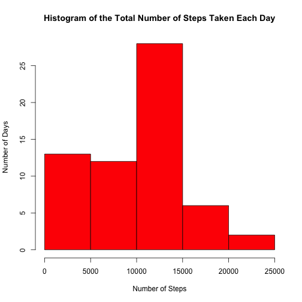
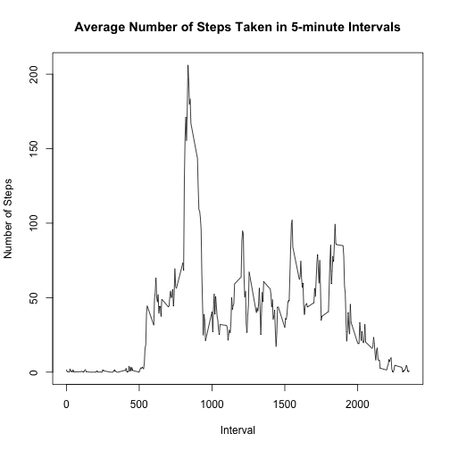
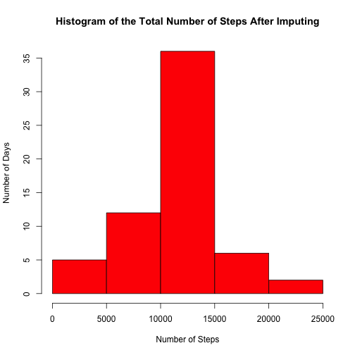
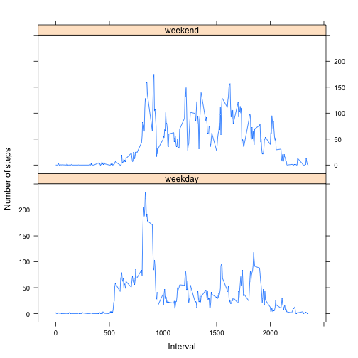

# Reproducible Research: Peer Assessment 1

```r
library(knitr)
opts_chunk$set(echo = TRUE)
```

## Loading and preprocessing the data

```r
unzip("activity.zip")
activity <- read.csv("activity.csv", sep = ",", header = TRUE, 
                    stringsAsFactors=FALSE)
activity$date <- as.Date(activity$date, "%Y-%m-%d")
```

## What is mean total number of steps taken per day?
1. Make a histogram of the total number of steps taken each day  
2. Calculate and report the mean and median total number of steps taken per day  

```r
dailysteps <- tapply(activity$steps, activity$date, sum, na.rm = TRUE)
hist(dailysteps, 
     col = "red",
     main = "Histogram of the Total Number of Steps Taken Each Day", 
     xlab = "Number of Steps",
     ylab = "Number of Days")
```

 

```r
mean(dailysteps)
```

```
## [1] 9354
```

```r
median(dailysteps)
```

```
## [1] 10395
```

## What is the average daily activity pattern?
1. Make a time series plot of the 5-minute interval (x-axis) 
and the average number of steps taken, averaged across all days (y-axis)  
2. Which 5-minute interval, on average across all the days in the dataset, 
contains the maximum number of steps?  

```r
avgsteps <- tapply(activity$steps, activity$interval, mean, na.rm = TRUE)
intervals <- activity[activity$date == "2012-10-12", ]$interval
plot(intervals, avgsteps, type = "l",
     main = "Average Number of Steps Taken in 5-minute Intervals",
     xlab = "Interval",
     ylab = "Number of Steps")
```

 

```r
intervals[avgsteps == max(avgsteps)]
```

```
## [1] 835
```

## Imputing missing values
1. Calculate and report the total number of missing values in the dataset  

2. Devise a strategy for filling in all of the missing values in the dataset -- 
in this case using mean for that 5-minute interval.   

3. Create a new dataset that is equal to the original dataset but with the 
missing data filled in.  

4. Make a histogram of the total number of steps taken each day and 
Calculate and report the mean and median total number of steps taken per day. 

```r
dim(activity[!complete.cases(activity), ])[1]
```

```
## [1] 2304
```

```r
activity$impute <- activity$steps
activity$impute[is.na(activity$impute)] <- avgsteps[match(activity$interval, intervals)]   
```

```
## Warning: number of items to replace is not a multiple of replacement
## length
```

```r
dailysteps2 <- tapply(activity$impute, activity$date, sum)
hist(dailysteps2, 
     col = "red",
     main = "Histogram of the Total Number of Steps After Imputing", 
     xlab = "Number of Steps",
     ylab = "Number of Days")
```

 

```r
mean(dailysteps2)
```

```
## [1] 10766
```

```r
median(dailysteps2)
```

```
## [1] 10766
```

```r
summary(activity)
```

```
##      steps            date               interval        impute     
##  Min.   :  0.0   Min.   :2012-10-01   Min.   :   0   Min.   :  0.0  
##  1st Qu.:  0.0   1st Qu.:2012-10-16   1st Qu.: 589   1st Qu.:  0.0  
##  Median :  0.0   Median :2012-10-31   Median :1178   Median :  0.0  
##  Mean   : 37.4   Mean   :2012-10-31   Mean   :1178   Mean   : 37.4  
##  3rd Qu.: 12.0   3rd Qu.:2012-11-15   3rd Qu.:1766   3rd Qu.: 27.0  
##  Max.   :806.0   Max.   :2012-11-30   Max.   :2355   Max.   :806.0  
##  NA's   :2304
```
Do these values differ from the estimates from the first part of the assignment?  
- YES  

What is the impact of imputing missing data on the estimates of 
the total daily number of steps?  
- The density looks more like a normal density with the mean 
and the median being equal. 

## Are there differences in activity patterns between weekdays and weekends?
1. Create a new factor variable in the dataset with two levels 
– "weekday" and "weekend" indicating whether a given date 
is a weekday or weekend day.

2. Make a panel plot containing a time series plot of 
the 5-minute interval (x-axis) and the average number of steps taken, 
averaged across all weekday days or weekend days (y-axis).  

```r
library(lattice)
activity$day <- as.factor(ifelse(weekdays(activity$date) %in% 
                                 c("Saturday","Sunday"), "weekend", "weekday"))

activity2 <- split(activity, activity$day)
avg_weekday <- tapply(activity2$weekday$steps, activity2$weekday$interval, 
                      mean, na.rm = TRUE)
avg_weekend <- tapply(activity2$weekend$steps, activity2$weekend$interval, 
                      mean, na.rm = TRUE)

act_weekday <- data.frame(cbind(avg_weekday, intervals, "weekday"), 
                          stringsAsFactors = FALSE)
act_weekend <- data.frame(cbind(avg_weekend, intervals, "weekend"), 
                          stringsAsFactors = FALSE)
names(act_weekday) <- c("steps", "interval", "day")
names(act_weekend) <- c("steps", "interval", "day")

activity3 <- rbind(act_weekday, act_weekend)

activity3$steps <- as.numeric(activity3$steps)
activity3$interval <- as.numeric(activity3$interval)

xyplot(steps ~ interval | day, data = activity3, layout = c(1, 2), 
       type = "l",
       xlab = "Interval",
       ylab = "Number of steps")
```

 
